# TREBALL DE RECERCA: COTXE AUTÒNOM

**FET PER:** Sergi Rodríguez Garcia, Joan Pla Capdevila, Enric Simó Benítez i Marcel Gonfaus Sant

**INSTITUT ESCOLA INDUSTRIAL**

**TUTOR:** JOSEP MARIA BERGADÀ FABREGAT

---

## INDEX

- 1\. ABSTRACT
- 2\. INTRODUCCIÓ
- 3\. MARC TEÒRIC
  - 3.1. HISTÒRIA DELS COTXES AUTÒNOMS
  - 3.2. QUÈ ÉS UN COTXE AUTÒNOM?
  - 3.3. COM FUNCIONA UN COTXE AUTÒNOM
  - 3.4. GRAUS D’AUTONOMIA
  - 3.5. BENEFICIS I INCONVENIENTS
- 4\. DESENVOLUPAMENT DEL DISSENY
  - 4.1. LA IDEA
  - 4.2. EL DISSENY
    - 4.2.3. COM HA ANAT AVANÇANT?
    - 4.2.4. IMPREVISTOS I MILLORES EN ELS PROTOTIPS
      - 4.2.4.1. PROTOTIP #1
      - 4.2.4.2. PROTOTIP #2
      - 4.2.4.3. PROTOTIP #3
  - 4.3. EL RESULTAT FINAL (ficar fotos cotxe)
- 5\. MECANISMES
  - 5.1. GEOMETRIA D’ACKERMAN
  - 5.2. TRANSMISSIÓ DEL DIFERENCIAL
  - 5.3. TRANSMISSIÓ ACKERMAN-SERVOMOTOR
  - 5.4. TRANSMISSIÓ MOTOR DIFERENCIAL
- 6\. IMPRESSORES 3D
  - 6.1. COM FUNCIONEN?
  - 6.2. QUINA IMPRESSORA 3D HEM UTILITZAT?
    - 6.2.1. BAMBU LAB P1S
    - 6.2.2. BAMBU LAB H2D
  - 6.3. PARÀMETRES D’IMPRESSIÓ
- 7\. MATERIALS UTILITZATS
  - 7.1. QUINS MATERIALS TENÍEM DISPONIBLES?
  - 7.2. MATERIALS PER A CADA PEÇA
- 8\. SENSORS
  - 8.1. Lidar ld500
  - 8.2. Sense HAT 1.0.0
  - 8.3. Sensors de proximitat (falta el model)
- 9\. ACTUADORS
  - 9.1. Motor GA12-N20 Encoder DC
  - 9.2. Servomotor (falta el model)
- 10\. CONTROLADORS
  - 10.1. Raspberry pi 4
  - 10.2. Driver TB6612
  - 10.3. Hobbywing BEC
  - 10.4. Bateries OVONIC LiPo
- 11\. Explicació de ROS 2
  - 11.1. Estructura de un node
- 12\. Planificació del codi
  - 12.1. Localització (Location)
  - 12.2. Mapeig (Mapping)
  - 12.3. Path Plan
  - 12.4. Control
    - 12.4.1. Sistema de seguretat
- 13\. Location
  - 13.1. Algoritme de localització del cotxe
  - 13.2. Lidar
- 14\. Mapeig
  - 14.1. lidar_image_creator
  - 14.2. lidar_processing
  - 14.3. Integració de la localització
- 15\. Path Plan
  - 15.1. Separació dels cons
  - 15.2. Generació del Path Plan
  - 15.3. Bridge
- 16\. Control
  - 16.1. Control de velocitat
  - 16.2. Control de la direcció
    - 16.2.1. Seguiment de la trajectòria
    - 16.2.2. Sistema de seguretat
  - 16.3. Comunicació amb el servomotor
- 17\. Organització global
- 18\. Simulacio i Launchers
  - 18.1. Simulació
  - 18.2. Launchers
- ANNEXOS
  - Annex 1: Codi exemple d'un node de ROS 2
  - Annex 2: Mapa conceptual del sistema
- ÍNDEX D'IMATGES
- ÍNDEX DE TAULES

---

## 1. ABSTRACT

### CASTELLÀ

El objetivo principal de este Trabajo de Investigación ha sido crear, a partir de los conocimientos de Bachillerato, un pequeño coche autónomo capaz de recorrer un circuito variable. Para llevar a cabo este proyecto se han usado conocimientos de programación, mecánica, electrónica, robótica e inteligencia artificial.

En la primera parte del trabajo se ha realizado una investigación sobre los coches autónomos y su evolución, con el objetivo de comprender su funcionamiento y adquirir los conocimientos necesarios para diseñar y construir nuestro propio coche autónomo. Posteriormente se han estudiado los recursos que se requieren para este trabajo, los componentes del coche y su chasis. Todo esto para poder desarrollar los programas para el vehículo.

Una vez finalizado el montaje, se han realizado diversas pruebas para comprobar que el coche funcione correctamente y corregir los errores cometidos en la parte de programación y de robótica. A continuación, se realizaron los primeros prototipos del circuito donde el coche funcionaría, para finalmente crear el circuito definitivo que permite diferentes recorridos en función de su montaje.

En conclusión, este Trabajo de Investigación demuestra que, con los conocimientos adquiridos durante el Bachillerato, dedicación y compromiso es posible crear un pequeño coche autónomo. Además, esta investigación ha permitido ampliar los conocimientos sobre programación, mecánica, robótica y poder comprender mejor el funcionamiento y las complejidades de los coches autónomos.

### ANGLÈS

The main objective of this Research Project was to build a small autonomous car with the knowledge acquired during high school. The car was designed to go through a variable circuit without human assistance. To do this project, knowledge of programming, mechanics, electronics and artificial intelligence was used.

The first part of the work focused on researching autonomous cars and their evolution. The aim was to understand how they work and to achieve the necessary knowledge needed to design and build our own autonomous car. Afterwards, the resources needed for the project, as well as the components of the car and the chassis were studied. All of this was to be able to develop the programming for the car.

Once the building part was finished, several tests were carried out to make sure that the vehicle worked properly and to correct the errors that were found during testing. After that, different prototypes of the circuit where the car would go were made, to finally create the variable circuit that allows different routes depending on the way it is built.

To sum up, this Research Project demonstrates that, with the knowledge acquired during high school, dedication and perseverance it is possible to create a small autonomous car. Moreover, this investigation allowed us to expand our knowledge of programming, mechanics and robotics, while providing a better understanding of how autonomous vehicles work and their complexities.

## 2. INTRODUCCIÓ

Els cotxes autònoms representen una de les tecnologies amb més potencial dins del sector de l'automoció. En els últims anys, empreses com Waymo, Tesla o Zoox han investigat i desenvolupat nombrosos prototips, fet que ha contribuït a l’evolució dels cotxes autònoms i ha despertat un gran interès per aquesta tecnologia. És un tema molt important, ja que podria reduir considerablement els accidents de trànsit produïts pels humans i millorar la conducció.

Aquest és un dels principals motius per a l’elecció d’aquest tema. Però també a nosaltres ens agraden bastant diversos apartats de la tecnologia com la mecànica, la programació o l’electrònica, i en els cotxes autònoms aquests apartats són essencials. A més, com que nosaltres som molt aficionats del món del motor i l’automobilisme, hem volgut dissenyar des de zero un cotxe imprès en 3D creat per nosaltres mateixos. D’altra banda, vam pensar com es podria crear un cotxe autònom i quines dificultats ens causaria fer-lo.

Nosaltres tenim 2 objectius principals, el primer és ser capaços de fer funcionar el cotxe sense cap intervenció humana. És a dir, que funcioni a través d’un programa fet amb el llenguatge Python i ROS2 (un programa el qual desconeixíem).

El segon principal objectiu és poder fer un circuit creat per peces encaixables pel qual el cotxe pugui moure’s sense cap problema. També, volem aprendre coneixements bàsics de mecànica i electrònica per anar ben preparats per un futur no molt llunyà.

Un altre objectiu molt important, és saber com funciona el llenguatge de programació ROS2 per poder fer funcionar el LiDAR i crear un mapa virtual a partir del que detecti, i Python per poder programar el cotxe perquè es mogui i pugui esquivar obstacles.

Per poder aconseguir tots aquests objectius, primer de tot vam fer una petita recerca sobre cotxes autònoms per saber com funcionen. Posteriorment, vam decidir qui seria l’encarregat de fer cada apartat i vam decidir els diferents programes per assolir els objectius. En l’apartat d’impressió 3D vam utilitzar el programa Fusion 360, per fer el circuit vam fer servir Inkscape i per programar ROS 2 i Python.

Un cop fet tot això vam començar amb la part pràctica fent diversos prototips de les peces del cotxe i del xassís fins a perfeccionar-ho, tot això fet amb impressió 3D. Per altra banda, la part del circuit la vam fer amb fusta utilitzant una talladora làser proporcionada per l’institut.

Voldríem agrair la col·laboració de l’Institut Escola Industrial, (falta afegir). Els quals ens han proporcionat tota l’ajuda i el material que ens ha fet falta al llarg del treball.

## 3. MARC TEÒRIC

### 3.1. HISTÒRIA DELS COTXES AUTÒNOMS

Tot va començar l’any 1925, quan l’empresa nord-americana Houdina Radio Control va crear un cotxe sense ningú al volant. No es tractava d’un vehicle autònom, ja que estava controlat a través d’un sistema de radiocontrol, que funciona amb una persona enviant ordres de moviment i direcció a través d'un comandament.

Aquest projecte va contribuir a imaginar noves possibilitats per al futur de l’automoció. Una d’aquestes persones va ser el dissenyador Norman Bel Geddes, qui l’any 1939 va presentar Futurama, una exposició on mostrava una possible ciutat del futur. En aquesta ciutat hi hauria milers de cotxes, propulsats per camps electromagnètics i serien controlats automàticament. Tot això, amb l’objectiu de reduir els accidents a les carreteres.

Durant els anys següents, els avenços en informàtica, sensors i intel·ligència artificial van permetre desenvolupar sistemes autònoms cada cop més avançats. Durant les dècades dels vuitanta i noranta, Ernst Dickmanns, un professor i investigador alemany va tenir un paper destacat en el desenvolupament d’aquestes tecnologies.

L’any 1987, Dickmanns va presentar el projecte VaMoRs. Es tractava de transformar una furgoneta Mercedes-Benz 508D en un vehicle autònom amb càmeres, sensors amb un gran nivell informàtic. Aquest prototip va arribar a velocitats de 90 km/h en autopistes alemanyes.

Anys més tard, el 1994, Dickmanns va crear el projecte VamP. On va modificar un cotxe Mercedes 500 SEL amb les tecnologies desenvolupades pel seu equip. El vehicle va dur a terme proves de llarga distància i va arribar a velocitats de 130 km/h pels afores de París. Gràcies a aquests avenços, la Comissió Europea va invertir en el projecte EUREKA Prometheus, un dels més importants sobre la conducció autònoma de l’època.

L’any 1995, Dickmanns va aconseguir unir Múnic amb Odense, Dinamarca, amb un Mercedes Clase S modificat. En total el vehicle va recórrer més de 1.750 quilòmetres esquivant i avançant cotxes, tot de manera autònoma.

<a id="imatge-1"></a>

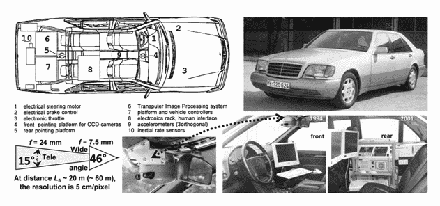

*Imatge 1: Projecte VaMP d'Ernst Dickmanns (Mercedes 500 SEL)*

L’any 2004, DARPA, una agència nord-americana, va impulsar el desenvolupament dels vehicles autònoms amb la creació del DARPA Grand Challenge, una competició destinada a posar a prova diferents sistemes de navegació autònoma.

El 2009, Google va iniciar el seu projecte de vehicles autònoms, liderat inicialment per l’enginyer Sebastian Thrun, que havia participat anteriorment al DARPA Grand Challenge. En el projecte es van fer diverses proves amb vehicles equipats amb sensors, càmeres i sistemes informàtics capaços de detectar l’entorn i prendre decisions.

L’any 2015 Google va presentar Firefly, un prototip dissenyat per estudiar la conducció sense els controls convencionals d’un automòbil. Estava equipat amb diferents sensors i sistemes informàtics i anava sense volant i pedals. Posteriorment, el projecte de Google es va convertir en Waymo, una empresa de tecnologia de conducció autònoma independent.

Waymo va continuar fent proves i desenvolupant els seus prototips, fins que l’any 2018 va llançar el seu servei de transport autònom en algunes zones determinades. Més endavant, el servei es va anar ampliant a més zones.

En conclusió, el desenvolupament dels cotxes autònoms ha estat progressiu i continuarà evolucionant a mesura que s’investiguin i desenvolupin noves tecnologies, amb l’objectiu de fer-los cada vegada més eficients i segurs.

### 3.2. QUÈ ÉS UN COTXE AUTÒNOM?

Els vehicles totalment automatitzats, també coneguts com a cotxes autònoms, son capaços de circular sense intervenció humana de manera continuada durant un període de temps. Per aconseguir-ho, utilitzen varies tecnologies com sensors de percepció de l’entorn, càmeres, ordinadors i programes informàtics que els permeten prendre decisions. Son capaços de percebre l’exterior, interpretar-ho, i prendre decisions en temps real per circular de manera segura.

### 3.3. COM FUNCIONA UN COTXE AUTÒNOM?

Aquests cotxes estan equipats amb varies tecnologies:

- Sensors de percepció de l'entorn:
- Sistemes de posicionament:
- Sistemes de comunicacions:
- Sistemes avançats de control:
- Sistemes d’aprenentatge automàtic:
- Algoritmes complexos:
- Actuadors:
- Sensors:

### 3.4. GRAUS D’AUTONOMIA

**GRAU 0 - MANUAL**

**GRAU 1 -**

**GRAU 2 -**

**GRAU 3 -**

**GRAU 4 -**

**GRAU 5 -**

### 3.5. BENEFICIS I INCONVENIENTS

## 4. DESENVOLUPAMENT DEL DISSENY

### 4.1. LA IDEA

Fer un projecte tan elaborat com el d’un cotxe autònom, va sorgir d’una pluja d’idees on volíem combinar diversos aspectes que a tots els components del grup els agradessin, ja sigui: programació, mecànica, electrònica…

Al principi es va dir de fer un avió a control remot, però en veure que s’havien d’aplicar molts conceptes nous dels quals desconeixíem, així que vam decidir de no fer-lo.

Quan es van fer els treballs de recerca de 2n de batxillerat, n’hi va haver un, on ens va cridar l’atenció a tots, un kart que es podia conduir. Allà va ser quan ens va venir la idea de fer un cotxe que no estigui conduït per un humà sinó per un ordinador. Així que es va acordar que faríem un cotxe autònom fet per nosaltres des de zero.

### 4.2. EL DISSENY

#### 4.2.1. INSPIRACIÓ DEL DISSENY DEL COTXE

El disseny del cotxe es va basar en diversos xassís de cotxes vistos des de dalt per saber la forma i l’estructura que tenen. Més endavant, mentre es va dissenyar en CAD, es va canviar una mica al disseny dibuixat originalment a un millorat i amb aspectes més innovadors.

#### 4.2.2. PROGRAMES DE DISSENY 3D

Avui en dia, hi ha molts softwares de disseny i modelat 3D, ja siguin: FreeCAD, Tinkercad, Blender, Fusion 360… Els quals alguns els hem treballat anys anteriors, però per fer aquest treball, es requereixen moltes funcions especials, així que hem optat l’ús de Fusion 360.

Fusion 360, és un programa de modelatge i disseny 3D amb llicència de pagament o pla gratuït, el qual és utilitzat per empreses molt famoses com Airbus o SpaceX i els empren als seus prototips.

Hem triat aquest programa principalment per la practicitat i la varietat d’opcions que ens dona alhora de programa, de modelatge i tecnicitat en quant importar i exportar models 3D.

Aquí hi ha una taula comparativa dels softwares:

<a id="taula-1"></a>

*Taula 1: Comparativa dels programes de disseny 3D*

| Programa | Avantatges | Inconvenients |
|---|---|---|
| Tinkercad | Fàcil | Massa limitat |
| Blender | Molt potent | Poc orientat a enginyeria |
| Fusion 360 | Paramètric i tècnic | Molt professional |

#### 4.2.3. COM HA ANAT AVANÇANT?

Quan vam començar a fer l’esbós inicial, no ens vam adonar d’alguns errors futurs, com el mecanisme de gir i l’espai que necessitarà, la posició del diferencial, o com anirà el motor connectat, entre altres problemes de locació i estètica.

#### 4.2.4. IMPREVISTOS I MILLORES EN ELS PROTOTIPS

Mentre s’anava dissenyant, vam començar a fer prototips sencers del que seria el resultat final amb les impressores proporcionades per l’escola, però com tot projecte elaborat, es van detectar diversos aspectes de millora. hi ha alguna cosa per arreglar i polir.

##### 4.2.4.1. PROTOTIP #1

En el primer prototip el vehicle estava separat en dues parts. Aquesta configuració feia que l'estructura fos més propensa a enfonsar-se o deformar-se si havia de suportar massa pes a la part superior.

També es va provar de fabricar una reductora d'engranatges pròpia. Tot i això, el disseny dels engranatges no era correcte i aquests lliscaven entre ells, de manera que no transmetien el moviment correctament.

A partir d'aquests problemes es van decidir diverses modificacions.

En primer lloc, es va passar a fabricar el xassís en una sola peça, amb l'objectiu d'aconseguir una estructura més resistent. També es van reforçar algunes parts que podien acabar trencant-se amb l'ús.

Pel sistema de transmissió es va abandonar la reductora d'engranatges que s'havia dissenyat inicialment i es va passar a utilitzar un motor reductor.

##### 4.2.4.2. PROTOTIP #2

En el segon prototip es van continuar fent modificacions a partir dels problemes i limitacions detectats anteriorment.

Es va decidir canviar el motor reductor usat anteriorment pel motor que es fa servir actualment, un motor GA12-N20 amb encoder de 6 V.

També es va modificar la geometria del vehicle per millorar el sistema de gir i es va augmentar una mica la batalla del vehicle. A més, es va augmentar l'amplitud de les rodes.

Un altre canvi important va ser la creació d'una nova peça en forma de L, dissenyada per connectar el servomotor amb la barra metàl·lica del sistema de direcció.

Aquestes modificacions es van fer amb l'objectiu de millorar la integració dels diferents elements mecànics i aconseguir un sistema de direcció més adequat per al vehicle.

##### 4.2.4.3. PROTOTIP #3

En el tercer prototip, s’ha augmentat la llargada del cotxe deguda la incorporació de sensors ultrasònics a la part posterior, s’ha fet un suport pel lidar just a sobre del tren de direcció.

Finalment, hem col·locat dos motors GA12-N20 amb encoder de 6 V per tenir més parell i una relació de transmissió de 2,5 voltes de roda per cada volta dels motors, junt amb un compartiment a la part inferior del cotxe per la bateria.

### 4.3. EL RESULTAT FINAL (adjuntar fotos cotxe)

En aquest apartat, es pot veure el resultat final del cotxe imprès i les seves dades.

<a id="taula-2"></a>

*Taula 2: Dimensions del cotxe*

| Característica | Mesura |
|---|---|
| Longitud | 330 mm |
| Amplada | 130 mm |
| Distància entre eixos | 176,8 mm |
| Amplada entre rodes | 130 mm |
| Diàmetre de les rodes | 56 mm |
| Alçada | Pendent de determinar |

## 5. MECANISMES

Per poder fer que el cotxe realitzi algunes de les seves funcions bàsiques, sigui girar o moure’s, fan falta una sèrie de mecanismes que són emprats als cotxes reals.

### 5.1. GEOMETRIA D’ACKERMAN

Per al sistema de direcció del vehicle es va utilitzar una geometria basada en el principi d'Ackermann.

La geometria d'Ackermann permet que, quan el vehicle gira, la roda interior faci una trajectòria de radi menor que la roda exterior. Per aquest motiu, les dues rodes davanteres no han de girar exactament el mateix angle.

Aquesta geometria permet millorar el comportament del vehicle durant els girs i reduir el lliscament de les rodes.

En el nostre vehicle, aquest sistema es va integrar amb un servomotor que permet controlar el moviment de la direcció.

<a id="imatge-2"></a>

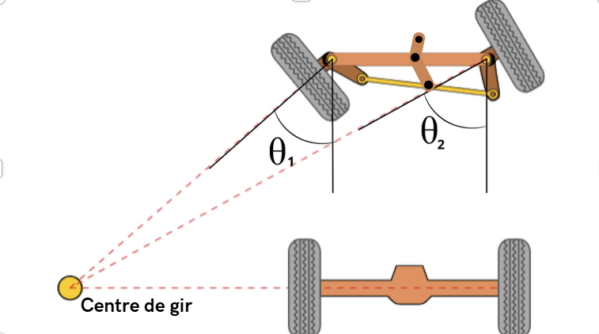

*Imatge 2: Geometria d'Ackermann (modificada)*

Com es pot veure en la imatge, l’angle de la roda interior (θ1) és major que la de l’exterior (θ2).

En aquesta captura, es pot apreciar la geometria d’Ackerman des de Fusion 360.

<a id="imatge-3"></a>

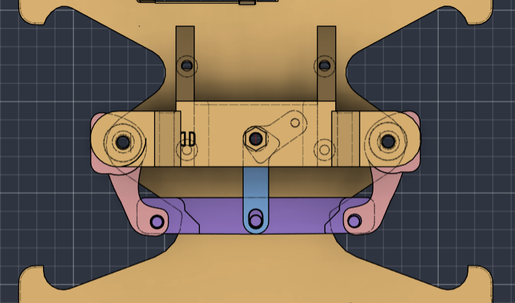

*Imatge 3: Geometria d'Ackermann del nostre cotxe. Feta des de Fusion 360.*

El que està en vermell és on van connectades les rodes, el braç lila és on van unides les dues peces vermelles i la palanca blava és on va connectat al servo i el braç lila per poder girar.

### 5.2. TRANSMISSIÓ DEL DIFERENCIAL

El grup diferencial d’un vehicle terrestre, es va crear el 1827 pels cotxes impulsats a vapor, que servia per impulsar amb la força del motor als eixos de les rodes de forma asimètrica quan giren en un revolt.

Avui dia és utilitzat a tot vehicle terrestre (excepte motocicletes) i fa la mateixa funció que fa gairebé dos-cents anys, tot i que s’ha anat millorant al llarg dels anys.

Hem volgut aplicar-lo al nostre cotxe per la mateixa raó que la geometria d’Ackerman i perquè així sigui més estable i no derrapi als revolts fent que la roda de l’exterior giri més de pressa que l’interior.

Consta d’un conjunt d’engranatges anomenats planetaris que són inserits dins d’una caixa metàl·lica girats 90° entre ells, i una corona (un engranatge més gran) que és unida a la caixa. Per transferir el moviment rotatori del motor, passa per un pinyó d’atac que està connectat a 90° de la corona.

<a id="imatge-4"></a>

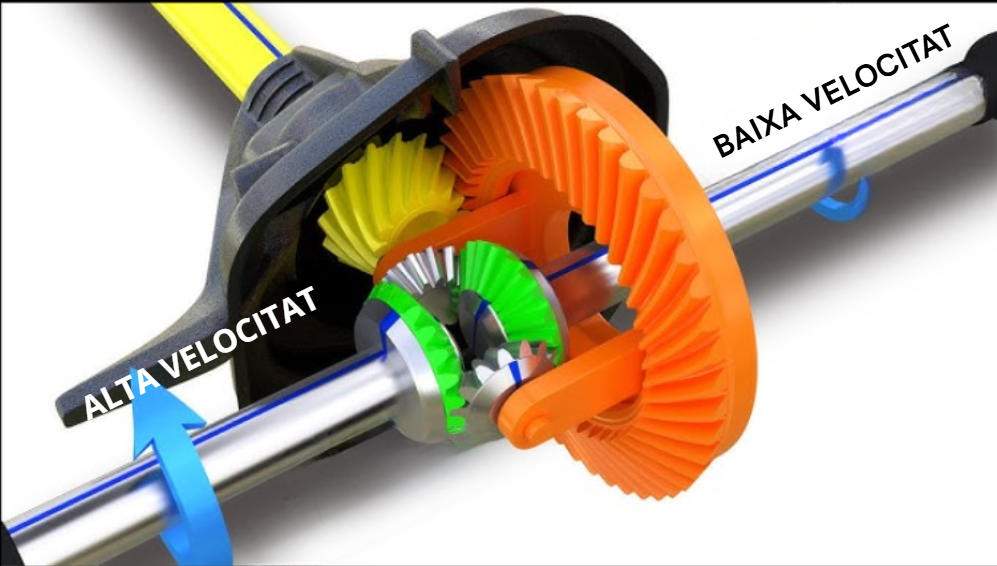

*Imatge 4: Funcionament del diferencial (modificada)*

Aquest és el nostre diferencial extret de Makerworld[^1] i modificat per nosaltres gràcies a lu_print.

[^1]: Makerworld és una pàgina web on pots penjar i trobar dissenys per imprimir en 3D de forma gratuita.

### 5.3. TRANSMISSIÓ ACKERMAN-SERVOMOTOR

Per controlar la direcció es va utilitzar un micro servomotor MG90S.

El servomotor permet controlar la posició de la direcció i està connectat mecànicament a una barra metàl·lica que transmet el moviment a les rodes.

La connexió entre el servomotor i la barra es realitza mitjançant unes anelles amb cargols i una peça en forma de L invertida. Aquesta peça va ser dissenyada únicament per al nostre cotxe.

La barra metàl·lica incorpora unes juntes de goma que permeten mantenir-la subjectada a la posició corresponent i evitar que es desprengui o llisqui durant el moviment.

El sistema que es va utilitzar inicialment era diferent. Primer es va provar un sistema format per un pinyó i una cremallera, però es va decidir canviar-lo perquè no funcionava com es necessitava. Posteriorment es va optar per utilitzar una barra articulada connectada al servomotor, la qual és travessada per uns fixadors que són enroscats per les parts blaves i vermelles en la següent imatge.

Finalment ha quedat així:

<a id="imatge-5"></a>

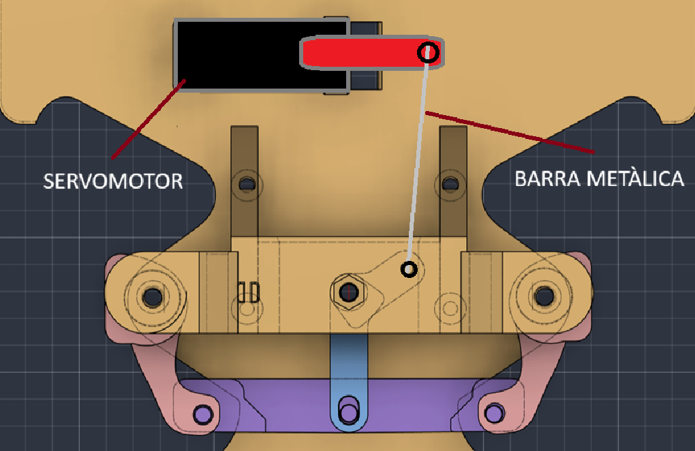

*Imatge 5: Transmissió Ackerman-servomotor. Feta des de Fusion 360.*

D'aquesta manera, el moviment del servomotor es transmet directament a la barra i aquesta produeix el moviment de les rodes.

### 5.4. TRANSMISSIÓ MOTOR DIFERENCIAL

En un gir, les dues rodes del mateix eix no recorren exactament la mateixa distància. Per tant, si les dues rodes estiguessin obligades a girar sempre a la mateixa velocitat, es produiria lliscament entre les rodes i el terra.

El diferencial permet solucionar aquest problema fent possible que les dues rodes girin a velocitats diferents.

En el nostre cas, el diferencial es va fer amb impressió 3D. El model inicial es va modificar per adaptar-lo al nostre vehicle.

Una de les modificacions va estar amb la subjecció i la transmissió del moviment. Inicialment, la peça no tenien els forats actuals i es plantejava utilitzar una barra de plàstic. Posteriorment es va decidir incorporar forats per poder utilitzar unes barres de ferro de 5 mm de gruix per tenir més força i que no siguin propenses a partir-se o doblegar-se.

També es van modificar els forats de la carcassa del diferencial i dels engranatges conductors perquè aquestes barres de 5 mm poguessin encaixar-hi a pressió.

Aquesta modificació va permetre adaptar el diferencial al sistema de muntatge del nostre cotxe.

Aquí es pot veure com ha quedat en el prototip final:

## 6. IMPRESSORES 3D

Per poder realitzar aquest projecte, s’han hagut d’utilitzar impressores 3D per crear-ho tot, des de les rodes fins al xassís. Hem fet l’ús de les impressores 3D de filament, ja que són les ideals per fer el treball.

### 6.1. COM FUNCIONEN?

Una impressora 3D de filament, diposita material plàstic desfet sobre una superfície calenta llisa. A través d’un capçal controlat per motors pas a pas i corretges, controlen el flux de plàstic i la posició del capçal.

Aquest procés el va fent capa per capa fins que la peça està completada.

La màquina llegeix un codi escrit en G-code[^2] fet per un laminador, segons la peça que vulguis imprimir, descarregues el codi o mitjançant Wi-Fi l’envies a l’impresora i ella ho imprimira automàticament.

[^2]: El G-code és un llenguatge de programació utilitzat per controlar màquines automàtiques com impressores 3D, fresadores CNC, talladores làser i torns. Actua com un traductor que converteix un model digital en una sèrie d'instruccions que són les que llegeix la màquina.

### 6.2. QUINA IMPRESSORA 3D HEM UTILITZAT?

Avui en dia, hi ha un gran ventall de marques d’impressores 3D, ja siguin: Prusa, Creality, Bambu Lab… A la nostra disposició, teníem les impressores Bambu Lab H2D i la Bambu Lab P1S, les quals són de les millors impressores 3D al mercat d’avui dia.

Tenen una qualitat i rapidesa d’impressió excepcional, això ens garanteix una bona impressió i cap errada gràcies als seus sistemes d’intel·ligència artificial i CoreXY. El CoreXY és com està controlat el capçal de l’impressora per dos motors pas a pas independents impulsats per corretges.

Durant el projecte es van utilitzar dues impressores 3D de Bambu Lab:

- Bambu Lab H2D
- Bambu Lab P1S

La H2D es va utilitzar principalment per fabricar el xassís i les rodes, mentre que la P1S es va utilitzar per als engranatges, prototips petits i altres peces.

La utilització de dues impressores va permetre repartir la fabricació de les diferents peces segons les necessitats de cada impressió.

#### 6.2.1. BAMBU LAB P1S

La Bambu Lab P1S és una de les primeres impressores tancades que va fer Bambu Lab, incorporant la tecnologia CoreXY. Destaca per la facilitat de muntatge, velocitat i fiabilitat. Inclou un volum d’impressió estàndard de 256 x 256 x 256 mm i porta un filtre de carboni per captar partícules perilloses a l’escalfar materials tècnics com l’ABS.

Només té un nozzle (extrusor per on surt el filament plàstic desfet) i per canviar de color o material s’ha de fer manualment o utilitzar el sistema AMS (en anglès) Automatic Material Sistem que ho fa automàticament.

<a id="imatge-6"></a>

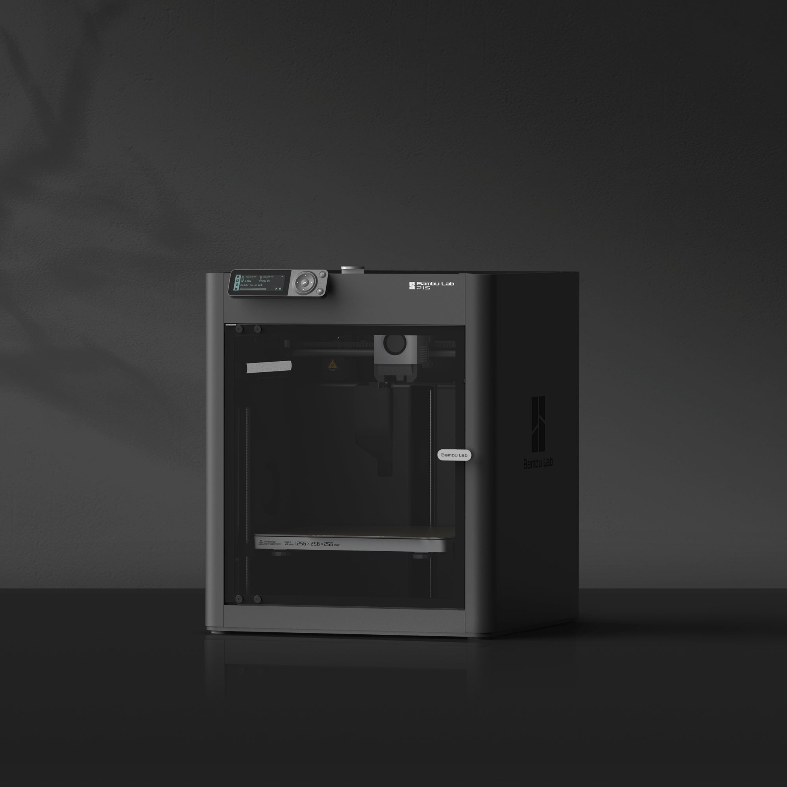

*Imatge 6: Bambu Lab P1S*

#### 6.2.2. BAMBU LAB H2D

La Bambu Lab H2D és una de les primeres impressores tancades tot en un de tipus industrial, incorpora la tecnologia CoreXY millorada respecte de la P1S.

Destaca per ser un llit híbrid de manufactura que combina impressió 3D ultraràpida, gravat i tall làser, i traçat a paper. Inclou un volum d’impressió molt més ampli, de 350 x 320 x 325 mm, i porta un potent sistema de ventilació amb filtre de carboni i cambra calefactada activa a 65 °C per treballar de manera segura amb materials tècnics avançats a altes temperatures.

A diferència de models anteriors, compta amb un doble nozzle (doble extrusor independent de dos extrusors), la qual cosa permet combinar materials rígids i flexibles com el TPU sense embussos.

Tot i que la Bambu Lab H2D sigui molt millor que la P1S, la P1S s’ha utilitzat per fer peces més petites i prototips, siguin suports o engranatges, que aniran al disseny final del cotxe.

<a id="imatge-7"></a>

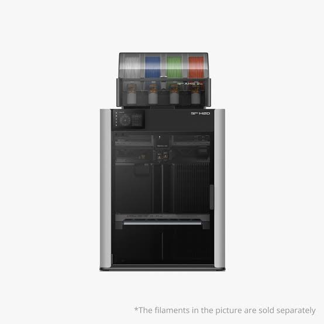

*Imatge 7: Bambu Lab H2D*

### 6.3. PARÀMETRES D’IMPRESSIÓ

Per a les impressions realitzades es van utilitzar principalment els següents paràmetres:

<a id="taula-3"></a>

*Taula 3: Paràmetres d'impressió*

| Paràmetre | Valor |
|---|---|
| Altura de capa | 0,2 mm |
| Infill | 15 % |
| Nombre de parets | 3 |
| Temperatura PLA | 220 °C |
| Temperatura PETG | 255 °C |
| Suports | Sí, en el xassís |

## 7. MATERIALS UTILITZATS

La impressió 3D utilitza una gran varietat de materials, cadascun s’adapta a diferents tecnologies i aplicacions, des de la rapidesa i facilitat d'ús fins a la resistència mecànica o tèrmica.

### 7.1. QUINS MATERIALS TENÍEM DISPONIBLES?

Per poder realitzar el nostre projecte usant impressores 3D, teníem tres opcions:

- **PLA (Àcid Polilàctic):** El material més comú i fàcil d'imprimir, s’imprimeix de 180 a 220 °C i és biodegradable. És ideal per a maquetes, decoració i prototips ràpids però poc resistent a la calor.
- **PETG (Polietilè tereftalat de glicol):** Té la facilitat d’impressió del PLA amb la resistència del material de les ampolles de plàstic, s’imprimeix de 220 a 255 °C. És més flexible que el PLA, resistent a l'aigua i als impactes.
- **ABS (Acrilonitril butadiè estirè):** Molt resistent i durador, aguanta bé les altes temperatures i es pot polir amb acetona, s’imprimeix de 230 a 250 °C. Requereix impressora tancada per evitar que es deformi durant la impressió.

### 7.2. MATERIALS PER A CADA PEÇA

Els principals materials utilitzats en la fabricació van ser PLA i PETG.

El PLA utilitzat era de Bambu Lab i Creality, mentre que el PETG utilitzat era de Creality.

La distribució dels materials va ser la següent:

<a id="taula-4"></a>

*Taula 4: Materials per a cada peça*

| Peça | Material |
|---|---|
| Xassís | PLA |
| Rodes | PLA |
| Diferencial | PETG |
| Engranatges | PETG |
| Suports | PLA |
| Altres peces | PLA |

El PLA es va utilitzar principalment en peces estructurals i altres parts del vehicle, mentre que el PETG es va utilitzar en peces que formen part del sistema de transmissió, com el diferencial i els engranatges.

No hem fet l’ús de l’ABS, perquè ens podrien donar problemes a l’hora d’imprimir-lo, i no l’hem treballat mai per la seva tecnicitat.

## 8. Sensors

### 8.1. Lidar ld500

El LiDAR LD500 serveix per saber a quina distància estan els objectes que hi ha al voltant del cotxe. Envia un làser i calcula el temps que triga a tornar després de rebotar contra un objecte.

En un cotxe autònom, s’utilitza principalment per detectar obstacles i evitar col·lisions. També ajuda el cotxe a saber com és l’espai que té al seu voltant.

DATASHEET

### 8.2. Sense HAT 1.0.0

El Sense HAT 1.0.0 és una placa que es pot connectar a una Raspberry Pi i que té diferents sensors. En un cotxe autònom pot servir per obtenir informació sobre el moviment i les condicions de l’entorn.

Té sensors per mesurar la temperatura, la pressió i la humitat, i també té una imu que es sensor que detecta el moviment, la inclinació i la direcció del cotxe.

Així, juntament amb el LiDAR, el Sense HAT permet obtenir més informació perquè el cotxe pugui saber què està passant mentre es mou.

DATASHEET

### 8.3. Sensors de proximitat (falta el model)

## 9. Actuadors

### 9.1. Motor GA12-N20 Encoder DC

El GA12-N20 Encoder DC és un motor petit que serveix per fer girar les rodes del cotxe. Està format per un motor de corrent continu i un encoder.

L’encoder permet saber com està girant el motor, per exemple la seva velocitat i quantes voltes ha fet. Això és útil en un cotxe autònom perquè permet controlar millor el moviment i fer que el cotxe avanci a la velocitat desitjada.

En el nostre cotxe, aquests motors s’utilitzen principalment per moure les rodes i controlar el desplaçament.

DATASHEET

### 9.2. Servomotor (falta el model)

## 10. Controladors

### 10.1. Raspberry pi 4

La Raspberry Pi 4 és el component principal que controla el cotxe. Rep la informació dels sensors, la processa i decideix què ha de fer el cotxe.

Per exemple, pot rebre informació del LiDAR i detectar que hi ha un obstacle. En aquest cas, pot enviar una ordre als motors perquè el cotxe freni o canviï de direcció.

DATASHEET

### 10.2. Driver TB6612

El TB6612 és un controlador que serveix per controlar els motors. La Raspberry Pi envia les ordres al driver i aquest controla la velocitat i el sentit de gir dels motors.

Això permet que el cotxe pugui avançar, anar enrere o girar.

DATASHEET

### 10.3. Hobbywing BEC

El Hobbywing BEC serveix per regular el voltatge que arriba als diferents components. La bateria dona una tensió que pot ser massa alta per a alguns components, i el BEC l’adapta perquè puguin funcionar correctament.

Així ajuda a protegir la Raspberry Pi i els altres components del cotxe.

DATASHEET

### 10.4. Bateries OVONIC LiPo

Les bateries OVONIC LiPo són les que proporcionen l’energia necessària perquè funcioni el cotxe. Alimenten els motors, la Raspberry Pi i la resta de components.

Les bateries LiPo tenen una bona relació entre pes i capacitat, per això són molt utilitzades en vehicles petits, drons i projectes de robòtica.

DATASHEET

## 11. Explicació de ROS 2

ROS 2 (Robot Operating System 2) és un framework de programari dissenyat principalment per al desenvolupament de sistemes robòtics. Permet executar diversos programes de manera simultània, compartir dades entre aquests programes i establir comunicació entre les diferents parts del sistema.

ROS 2 funciona principalment mitjançant un sistema de nodes i topics. Cada node és un programa que realitza una determinada funció, mentre que els topics són canals de comunicació que permeten transmetre dades entre els diferents nodes.

Un node pot publicar dades en un topic, és a dir, enviar informació, o pot estar subscrit a un topic, de manera que rep les dades que es publiquen en aquest canal. D'aquesta manera, diferents programes poden treballar de forma independent però compartir la informació necessària.

A més dels nodes i els topics, un projecte de ROS 2 necessita una determinada estructura d'arxius i directoris perquè pugui ser compilat i executat correctament. Alguns directoris, com `build`, `install` i `log`, són generats automàticament durant el procés de compilació amb `colcon build`, que és l'eina de compilació utilitzada habitualment en ROS 2.

D'altra banda, hi ha arxius que formen part de l'estructura del paquet i que han de ser configurats pel programador. Entre aquests es troben `package.xml`, `setup.py` i, segons el tipus de paquet, `CMakeLists.txt`. També existeixen directoris com `src`, on es troba el codi font del projecte, i els diferents directoris interns del paquet.

En aquest projecte s'ha utilitzat la versió ROS 2 Jazzy. La guia oficial per instal·lar-la es pot trobar a: [Instal·lació de ROS 2 Jazzy](https://docs.ros.org/en/jazzy/Installation.html).

<a id="imatge-8"></a>

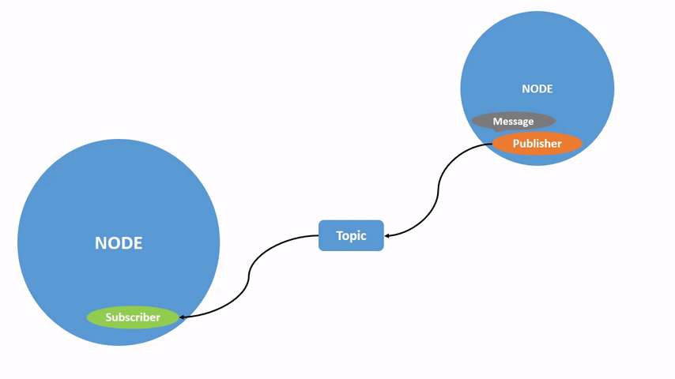

*Imatge 8: Exemple simple funcionament ros2*

### 11.1. Estructura de un node

El codi complet d'aquest exemple es troba a l'[Annex 1](#annex-1).

Aquest exemple mostra l’estructura bàsica d’un node de ROS 2 desenvolupat en Python.

En primer lloc es troben els imports, que incorporen les llibreries i els tipus de missatge necessaris. En aquest cas, `rclpy` proporciona les eines necessàries per treballar amb ROS 2, `Node` permet crear el node i `String` és el tipus de missatge utilitzat.

```python
import rclpy
from rclpy.node import Node
from std_msgs.msg import String
```

A continuació es defineix la classe del node, que hereta de `Node`. Aquesta classe conté els elements que determinen el comportament del node.

```python
class MyNode(Node):
```

El mètode `__init__()` és el constructor i s’executa quan es crea una instància del node. En aquest apartat es configura el node i es creen els elements de comunicació. En l’exemple es crea un subscriber, que rep missatges del topic `my_topic`, i un publisher, que permet publicar-hi missatges.

```python
    def __init__(self):
        super().__init__('my_node')

        self.subscription = self.create_subscription(
            String,
            'my_topic',
            self.listener_callback,
            10
        )
        self.publisher = self.create_publisher(
            String,
            'my_topic',
            10
        )
```

El subscriber està associat a la funció `listener_callback()`. Aquesta funció és un callback, és a dir, una funció que ROS 2 executa quan es rep un missatge en el topic al qual el node està subscrit. És on es troba el codi executable com a tal.

```python
    def listener_callback(self, msg):
        print('Missatge rebut:', msg.data)
```

Finalment, la funció `main()` s’encarrega de la inicialització i execució del node.

```python
def main(args=None):
    rclpy.init(args=args)

    node = MyNode()
    rclpy.spin(node)
    node.destroy_node()
    rclpy.shutdown()
```

## 12. Planificació del codi

El codi del projecte estarà basat en un sistema SLAM (Simultaneous Localization and Mapping). L'objectiu principal serà aconseguir que el vehicle sigui capaç de localitzar-se dins de l'entorn mentre construeix simultàniament un mapa del seu voltant.

Per facilitar el desenvolupament i l'organització del programa, el sistema es dividirà en quatre grans blocs: localització (Location), mapeig (Mapping), traçada (Path Plan) i control (Control). Cada bloc estarà format per diferents nodes de ROS 2, que s'encarregaran d'una funció concreta.

### 12.1. Localització (Location)

Aquesta part tindrà com a objectiu determinar la posició i l'orientació del vehicle en tot moment.

Per aconseguir-ho, es desenvoluparan els següents nodes:

- **Node de l'IMU:** s'encarregarà de llegir les dades proporcionades per la unitat de mesura inercial, principalment l'acceleració i la velocitat angular del vehicle.
- **Node de l'encoder:** llegirà els impulsos de l'encoder del motor i permetrà calcular la velocitat del vehicle i la distància recorreguda.
- **Node de l'angle de direcció:** transformarà la resposta del servo en l'angle real de direcció de les rodes, de manera que aquest valor pugui ser utilitzat posteriorment pel model de moviment del vehicle.
- **Node d'odometria:** utilitzarà la velocitat del vehicle, l'angle de direcció i les dades de l'IMU per calcular la posició i l'orientació del vehicle mitjançant el model bicycle. Aquest càlcul permetrà obtenir una estimació contínua de la trajectòria del vehicle.
- **Node de localització mitjançant LiDAR:** utilitzarà les dades del LiDAR per comparar l'entorn observat amb el mapa i corregir l'error acumulat per l'odometria. D'aquesta manera, es podrà reduir el drift de la posició estimada.

### 12.2. Mapeig (Mapping)

Aquesta part tindrà com a objectiu crear i actualitzar el mapa de l'entorn a partir de les dades obtingudes pel LiDAR.

Per aconseguir-ho, es desenvoluparan els següents nodes:

- **Node de lectura del LiDAR:** s'encarregarà de comunicar-se amb el sensor i obtenir les lectures de distància i angle.
- **Node de processament de les dades del LiDAR:** transformarà i filtrarà les dades obtingudes perquè siguin adequades per als processos posteriors. Entre altres operacions, podrà eliminar mesures incorrectes, reduir el soroll i transformar les coordenades polars del LiDAR en coordenades cartesianes.
- **Node de creació del mapa:** utilitzarà les dades processades del LiDAR juntament amb la posició estimada del vehicle per construir i actualitzar el mapa de l'entorn. Aquest node constituirà una de les parts principals del sistema SLAM.
- **Visualització del mapa:** el mapa i la posició del vehicle es podran visualitzar mitjançant RViz2, permetent comprovar visualment el funcionament del sistema i detectar possibles errors.

### 12.3. Path Plan

El Path Plan s'encarregarà de crear la traçada a partir del mapa prèviament creat. Per fer-ho, seran necessaris els següents nodes:

- **Node de Path Plan:** s'encarregarà de crear la traçada que haurà de seguir el vehicle. Per fer-ho, s'utilitzaran algoritmes ja existents, adaptats a les necessitats del projecte.
- **Node PON:** s'encarregarà de transformar i preparar les dades generades pel Path Plan perquè puguin ser utilitzades correctament pel sistema de control.

### 12.4. Control

Finalment, el bloc de Control tindrà com a objectiu controlar el vehicle perquè segueixi la traçada generada pel Path Plan.

Per aconseguir-ho, es desenvoluparan els següents nodes:

- **Node de control de velocitat:** tindrà la tasca de mantenir el vehicle a la velocitat objectiu.
- **Node de control:** tindrà com a objectiu calcular l'angle de direcció necessari per seguir la traçada.
- **Node de direcció:** transformarà l'angle de direcció objectiu en una instrucció adequada per al servo.

#### 12.4.1. Sistema de seguretat

En cas que el sistema principal presenti algun error, s'afegirà un sistema de control de seguretat format per dos nodes:

- **Node de control amb sensors de proximitat:** utilitzarà dos sensors de proximitat amb l'objectiu d'assegurar que el vehicle no col·lideixi amb cap obstacle o paret.
- **Node de lectura dels sensors:** s'encarregarà de llegir i publicar les dades dels sensors de proximitat perquè puguin ser utilitzades pel node de control de seguretat.

## 13. Location

Aquesta part del codi s'encarregarà de localitzar el cotxe, per això estarà separat en dos parts principals.

La primera es la encarregada de recollir dades, comptarà amb els nodes:

- `src/codi_principal/nodes/location/motor_reader`
- `src/codi_principal/nodes/location/imu/imu_reader`

Encarregats de llegir les dades de la IMU i del encoder del motor per tal de ser posible treballar amb elles

També está el node principal

- `src/codi_principal/nodes/location/bicycle_model/bicycle_model`

### 13.1. Algoritme de localització del cotxe

L'objectiu d'aquest node és localitzar el cotxe, és a dir, calcular la seva posició (x,y) i la seva orientació al llarg del temps. Per fer-ho utilitza l'algoritme Bicycle Model, anomenat així perquè permet simplificar el moviment d'un cotxe representant-lo com si fos una bicicleta.

Aquest model considera que el moviment del vehicle depèn principalment de la velocitat, de l'angle de les rodes i de la distància entre els eixos. A partir d'aquests paràmetres es pot calcular el radi de gir mitjançant:

```text
R = L / tan(δ)
```

On:

- R = radi de gir.
- L = distància entre l'eix davanter i l'eix posterior.
- δ = angle de les rodes respecte de l'eix longitudinal del cotxe.

Un cop conegut el radi de gir, es pot calcular la velocitat angular del cotxe:

```text
ω = v / R
```

I, substituint el radi de gir:

```text
ω = (v / L) · tan(δ)
```

D'aquesta manera, utilitzant la velocitat del cotxe, obtinguda a partir de l'encoder i la IMU, i l'angle de les rodes, el node pot calcular com varia l'orientació del cotxe i, a partir d'aquesta, calcular el seu desplaçament en els eixos x i y.

El temps transcorregut entre dues actualitzacions també es té en compte, de manera que en cada iteració es calcula una nova posició:

```text
x_nova = x + v · cos(θ) · Δt
y_nova = y + v · sin(θ) · Δt
```

I una nova orientació:

```text
θ_nova = θ + (v / L) · tan(δ) · Δt
```

Així, el node estima contínuament la posició i l'orientació del cotxe a partir del seu moviment.

<a id="imatge-9"></a>

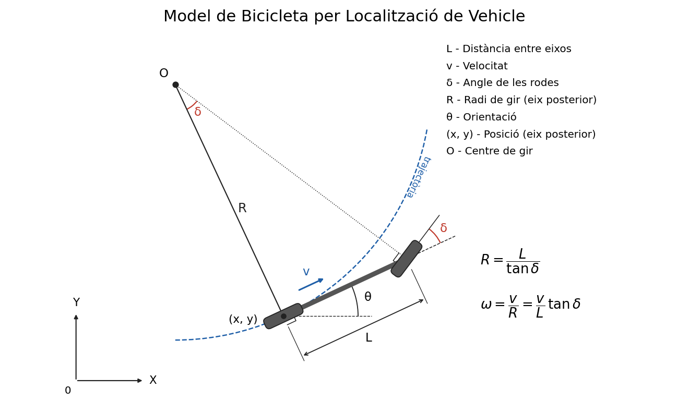

*Imatge 9: Dibuix orientatiu bicycle model*

### 13.2. Lidar

La localització del cotxe mitjançant el lidar es troba en un node de mapping per temes de comoditat al programar

## 14. Mapeig

Aquesta part del codi s’encarrega de crear el mapa del circuit a partir de les dades de localització del cotxe, prèviament processades, i de les dades obtingudes mitjançant el LiDAR.

El codi encarregat de llegir el LiDAR es troba a `src/lidar_drivers` i no ha estat desenvolupat pel programador del grup. Es tracta del codi recomanat pel fabricant d’acord amb les especificacions del sensor (datasheet). Aquest codi publica, després de cada volta completa del LiDAR, les dades de lectura en forma de coordenades angulars al topic `LaserScan`.

Els nodes utilitzats en aquesta part del projecte són:

- `src/codi_principal/nodes/mapping/lidar/lidar_image_creator`
- `src/codi_principal/nodes/mapping/lidar/lidar_processing`
- `src/codi_principal/nodes/mapping/lidar/cone_map_viz`

### 14.1. lidar_image_creator

Aquest node està subscrit al topic `LaserScan` i s’encarrega de processar les dades obtingudes del LiDAR. Les seves funcions principals són eliminar lectures errònies, convertir les coordenades angulars a coordenades cartesianes, transformar les coordenades locals a coordenades globals i corregir la distorsió provocada pel moviment del cotxe durant l’escaneig.

La conversió de coordenades angulars a cartesianes es realitza mitjançant raons trigonomètriques. A partir de la distància i l’angle de cada punt, es calculen les seves coordenades X i Y.

Posteriorment, les coordenades locals es transformen en coordenades globals tenint en compte la posició i l’orientació del cotxe. D’aquesta manera, els punts detectats pel LiDAR es poden situar correctament dins del mapa global.

La tasca més complexa és corregir la distorsió provocada pel moviment del cotxe durant el temps que el LiDAR necessita per completar una volta. Com que els punts no es capturen tots al mateix instant, la posició del cotxe és diferent en el moment de capturar cada punt.

Per solucionar-ho, el codi estima la posició del cotxe en el moment en què es va capturar cada punt. Per fer-ho, utilitza la mateixa fórmula emprada per calcular la posició del cotxe i estima quant s’ha desplaçat entre la captura de cada punt i el moment actual. El temps entre punts es calcula a partir del temps necessari per rebre les diferents lectures i es distribueix entre els punts de l’escaneig.

D’aquesta manera, es pot compensar el moviment del cotxe i obtenir una representació dels punts molt més fidel a la seva posició real.

### 14.2. lidar_processing

Aquest node està subscrit al topic `scan_xy` i té com a objectius detectar els cons i incorporar-los al mapa global.

La detecció dels cons es realitza mitjançant un algoritme de clustering, que té com a objectiu agrupar punts que es troben prou a prop els uns dels altres.

Per entendre el funcionament de l’algoritme, suposem que `scan_xy` ha detectat els punts A, B, C, D, etc. Primer, l’algoritme crea una matriu anomenada `cluster` i hi afegeix el punt A. A continuació, compara la distància entre A i B mitjançant el teorema de Pitàgores.

Si la distància és inferior a un valor llindar preestablert, anomenat threshold, es considera que els dos punts pertanyen al mateix grup. En aquest cas, es calcula la mitjana de les seves coordenades i s’utilitza aquest valor com a representació del grup.

Si la distància és superior al threshold, el punt B es considera un punt diferent i s’afegeix a la matriu `cluster`. A continuació, el punt C es compara amb els grups existents i es repeteix el mateix procés.

Aquest procediment continua fins que s’han processat tots els punts de `scan_xy`.

Per evitar considerar com a cons els grups formats per punts aïllats o per lectures errònies, s’utilitza un comptador de punts. Aquest comptador registra quants punts formen part de cada grup. Si un grup no arriba a un mínim de 3 punts, es descarta.

Com a resultat, s’obté una matriu que conté únicament els cons detectats durant una volta del LiDAR. Aquesta matriu és temporal i es torna a generar cada vegada que el LiDAR completa una nova volta.

La creació del mapa global utilitza un algoritme similar al de la detecció de cons. La principal diferència és que, en aquest cas, la matriu inicial és `cluster`, obtinguda a partir de l’escaneig actual, i el resultat es conserva entre les diferents voltes del LiDAR.

Quan es detecta un con que ja forma part del mapa, la seva posició s’actualitza a partir de la nova mesura. D’aquesta manera, les diferents deteccions del mateix con es poden combinar i reduir l’error de la seva posició. Per tant, a mesura que el cotxe realitza més voltes i obté noves mesures, el mapa es va actualitzant i les posicions dels cons es poden determinar amb més precisió.

### 14.3. Integració de la localització

Un cop desenvolupat el codi, es va considerar més eficient integrar el processament de la localització dins del mateix node `lidar_processing` en lloc de crear un node independent.

Això es deu al fet que la informació necessària per actualitzar la posició dels cons és principalment la diferència entre les posicions obtingudes en les diferents deteccions. El programa calcula aquestes diferències, en determina la mitjana i l’aplica a la posició actual del cotxe.

D’aquesta manera, no és necessari crear un node addicional que realitzi aquest càlcul. Això permet reduir la quantitat de processos que s’executen simultàniament i, per tant, disminuir la càrrega de la CPU.

### cone_map_viz

Aquest node s'encarrega de permetre que puguis veure el mapa amb una eina anomenada RVIZ que ve incorporada amb ros2

## 15. Path Plan

Aquesta part del codi té com a objectiu utilitzar el mapa de cons per crear una traçada que el vehicle pugui seguir. L’algoritme utilitzat està basat en el desenvolupat per l’equip de Formula Student FaSTTUBe (Formula Student Team TU Berlin). Ha resultat especialment pràctic per al nostre projecte, ja que les competicions de Formula Student inclouen proves de conducció autònoma i aquest equip també utilitza un LiDAR per obtenir informació del circuit.

A causa de la seva complexitat, aquesta part no ha estat desenvolupada directament pel programador del grup. Per aquest motiu, en aquest apartat se’n farà una explicació breu i simplificada del funcionament.

L’algoritme es divideix en dues fases principals:

### 15.1. Separació dels cons

En primer lloc, l’algoritme analitza el mapa i intenta determinar quins cons corresponen a la banda esquerra del circuit i quins corresponen a la banda dreta.

Aquesta separació és necessària perquè posteriorment l’algoritme pugui determinar l’espai que hi ha entre les dues bandes del circuit.

### 15.2. Generació del Path Plan

Un cop separats els cons, es genera la traçada central del circuit mitjançant triangulació.

L’algoritme genera triangles entre punts de les dues bandes del circuit i utilitza la geometria resultant per determinar punts situats entre ambdues bandes. Aquests punts formen la traçada que haurà de seguir el vehicle.

Finalment, es generen punts addicionals entre els punts obtinguts per reduir la distància entre ells i aconseguir una trajectòria més contínua i adequada per al seguiment del vehicle.

<a id="imatge-10"></a>

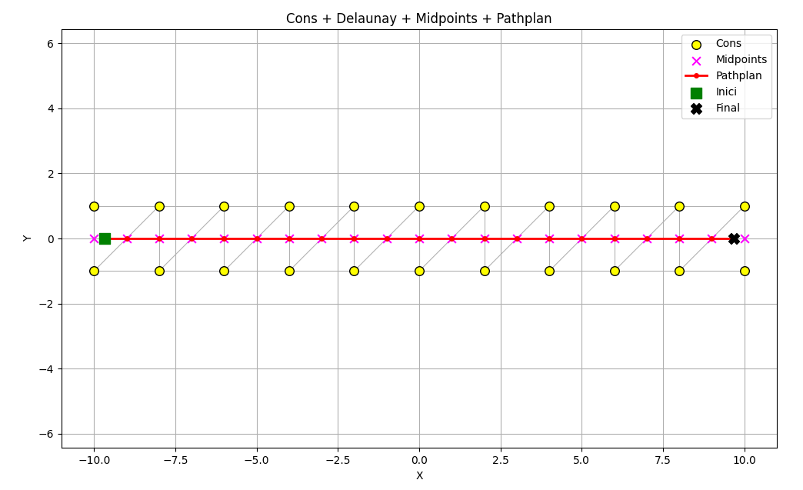

*Imatge 10: Simulació path plan en una recta*

### 15.3. Bridge

Per poder utilitzar aquest algoritme dins del projecte s’han creat dos nodes:

- `src/codi_principal/nodes/path_planning/path_planner_bridge_node.py`
- `src/codi_principal/nodes/path_planning/bridge_utils.py`

Aquests nodes actuen principalment com a pont entre el nostre sistema i els algoritmes de Path Plan, gestionant-ne la comunicació i fent possible la seva integració amb la resta del projecte.

## 16. Control

Finalment, tenim el sistema de control, que té la tasca de controlar i conduir el cotxe. Aquest sistema s'encarrega principalment del control de la velocitat i del control de la direcció.

### 16.1. Control de velocitat

El control de velocitat es realitza mitjançant un PID (Proporcional, Integral i Derivatiu). Es tracta d'un algoritme de control que té com a objectiu mantenir una variable en un valor desitjat, també anomenat setpoint. En aquest cas, la variable controlada és la velocitat del cotxe, mentre que el valor objectiu serà una velocitat determinada.

El PID calcula contínuament la diferència entre la velocitat objectiu i la velocitat real mesurada. A partir d'aquest error, calcula la correcció que s'ha d'aplicar utilitzant tres components:

- **Proporcional (P):** reacciona a l'error actual. Com més gran sigui l'error, més gran serà la correcció aplicada.
- **Integral (I):** acumula els errors produïts al llarg del temps. Serveix per corregir errors persistents que el component proporcional, per si sol, no és capaç d'eliminar.
- **Derivatiu (D):** analitza com està canviant l'error i permet anticipar-ne l'evolució. Això ajuda a reduir les oscil·lacions i evita que el sistema sobrepassi excessivament el valor objectiu.

<a id="imatge-11"></a>

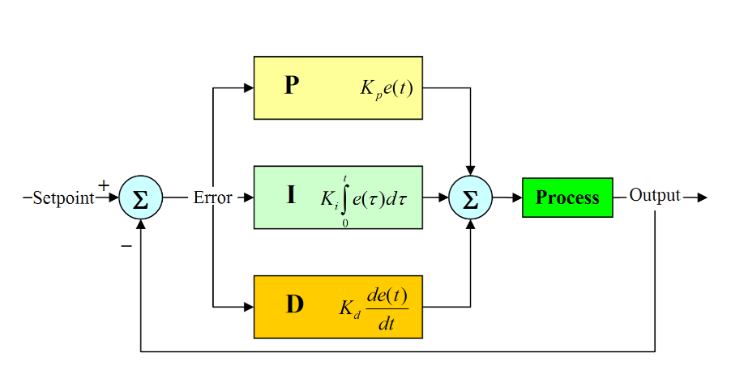

*Imatge 11: Explicació PID*

D'aquest control de velocitat se n'encarrega el node:

- `src/codi_principal/nodes/control/speed_control`

### 16.2. Control de la direcció

Per controlar la direcció del cotxe s'utilitzen dos sistemes diferents: un sistema principal encarregat de seguir la trajectòria calculada i un sistema de seguretat que actua en cas que els altres sistemes fallin.

#### 16.2.1. Seguiment de la trajectòria

El sistema principal de control de la direcció es troba al node:

- `src/codi_principal/nodes/control/path_follower`

L'algoritme utilitzat és el Pure Pursuit. El seu funcionament consisteix a crear un cercle imaginari al voltant del cotxe amb un radi determinat, conegut com a lookahead distance. A continuació, busca un punt de la trajectòria o path plan que es trobi sobre el perímetre d'aquest cercle.

Un cop seleccionat aquest punt, l'algoritme calcula quin ha de ser el radi de gir del cotxe perquè aquest pugui arribar al punt seleccionat. A partir d'aquest radi de gir es calcula l'angle de direcció necessari.

Aquest algoritme resulta especialment útil perquè no reacciona únicament a la posició actual del vehicle, sinó que té en compte un punt situat més endavant en la trajectòria. D'aquesta manera, el cotxe pot anticipar-se als girs que haurà de realitzar.


#### 16.2.2. Sistema de seguretat

El segon sistema de control es troba al node:

- `src/codi_principal/nodes/control/proximity_sensors`

Aquest sistema funciona com un mecanisme de seguretat. En cas que els sistemes de mapping, location o path planning fallin, el cotxe disposa de dos sensors de proximitat que permeten detectar la presència de parets o obstacles propers.

Utilitzant un altre controlador PID, el sistema modifica la direcció del vehicle amb l'objectiu d'evitar una col·lisió. Es tracta d'un algoritme relativament simple, però pot permetre evitar que el cotxe xoqui en cas que el sistema principal deixi de funcionar correctament.

### 16.3. Comunicació amb el servomotor

Finalment, el node:

- `src/codi_principal/nodes/control/steering`

És l'encarregat de comunicar-se directament amb el servomotor de direcció. Aquest node transforma l'angle de direcció calculat pels diferents sistemes de control en una ordre adequada per al servomotor, permetent moure físicament les rodes fins a la posició necessària.

## 17. Organització global

En el següent esquema ([Annex 2](#annex-2)) es mostra l’organització del sistema. Com es pot veure a la llegenda, els diferents elements es representen mitjançant formes i colors segons la seva funció.

### 17.1. LLEGENDA

Les formes rodones representen els nodes, que són els diferents programes que executen les funcions del sistema. Els rombes representen els topics o les lectures dels sensors, que permeten transmetre informació entre els diferents nodes. Alguns topics no estan representats explícitament perquè no són importants per entendre el funcionament general del sistema; en aquests casos, simplement es mostra la fletxa i es dona per fet que existeix un topic entre els elements.

Les fletxes també es diferencien segons el tipus de comunicació:

- Les línies contínues indiquen que el topic activa el node, però la informació que conté el topic no és utilitzada pel node.
- Les línies discontínues indiquen que el topic transmet informació al node, però no activa el node.
- Les línies de guions i punts indiquen que el topic activa el node i, al mateix temps, li transmet informació.

Finalment, els colors indiquen a quin bloc del codi pertany cada element. El color verd correspon al bloc de localització, el lila al bloc de mapatge, el groc al bloc de path plan i el vermell al bloc de control.

### 17.2. Explicació

Com es pot veure, el funcionament del codi comença amb la lectura del LiDAR (LaserScan). Aquesta lectura activa els nodes encarregats de llegir la velocitat i altres dades necessàries per poder localitzar el cotxe.

Un cop finalitzada la localització, s’activen els algoritmes de mapping. D’aquesta manera, com que per realitzar la localització és necessari disposar de les dades del LaserScan, i el processament de la localització triga més temps que el processament necessari perquè el LaserScan arribi a `lidar_image_creator`, els nodes de mapping no poden començar a treballar fins que no disposen de totes les dades necessàries.

Seguit, `lidar_processing` calcula la nova localització del cotxe i la transmet a `bicycle_model`. D’aquesta manera, el LaserScan actua com una mena de rellotge del sistema, ja que marca el ritme d’actualització i assegura que, en cada iteració, es treballi amb les dades més actuals disponibles.

Finalment es realitza el path plan i s'utilitza per fer el control seguint la mateixa norma d'iniciar els nodes amb les dades que triguin més a arribar s'utilitza per fer el control

## 18. Simulacio i Launchers

### 18.1. Simulació

Per poder provar el codi sense haver d'utilitzar el cotxe real, s'ha creat un simulador, que es troba al paquet `src/car_simulator`.

El simulador recrea dues coses: el moviment del cotxe i la lectura del LiDAR. Per una banda, calcula com es mou el cotxe a partir de l'angle de direcció i la velocitat que li envia el codi de control, utilitzant el mateix Bicycle Model explicat a l'apartat 13.1. Per l'altra, a partir de la posició del cotxe i d'un mapa amb la posició dels cons, genera les mateixes dades que enviaria el LiDAR real.

D'aquesta manera, la resta del sistema (mapeig, path plan i control) és exactament el mateix codi que s'executa al cotxe, i el resultat es pot veure a RViz2.

Per executar la simulació s'utilitza la comanda:

```bash
ros2 launch my_pakage simulation_full.launch.py track:=bcn
```

El paràmetre `track` permet escollir el circuit (`bcn` o `realista`).

### 18.2. Launchers

Com que el projecte està format per molts nodes que s'han d'executar alhora, s'utilitzen launchers, que són fitxers que inicien tots els nodes necessaris amb una sola comanda. Es troben a `src/codi_principal/launch`.

El launcher principal és `full_car.launch.py`, que és el que s'utilitza al cotxe real. Inicia tots els nodes del sistema: el driver del LiDAR, la lectura de l'encoder i la IMU, la localització, el mapeig, el path plan, el control de velocitat i la direcció. A més, tots els paràmetres físics del cotxe es troben definits al principi d'aquest fitxer, de manera que si es canvia alguna peça només cal modificar-los en un sol lloc.

Per executar-lo s'utilitza la comanda:

```bash
ros2 launch my_pakage full_car.launch.py
```

## ANNEXOS

<a id="annex-1"></a>

### Annex 1: Codi exemple d'un node de ROS 2

El codi està escrit en un altre format degut a que el interprete del codi només llegeix aquest format

```python
import rclpy
from rclpy.node import Node
from std_msgs.msg import String


class MyNode(Node):

    def __init__(self):
        super().__init__('my_node')

        self.subscription = self.create_subscription(
            String,
            'my_topic',
            self.listener_callback,
            10
        )
        self.publisher = self.create_publisher(
            String,
            'my_topic',
            10
        )

    def listener_callback(self, msg):
        print('Missatge rebut:', msg.data)


def main(args=None):
    rclpy.init(args=args)

    node = MyNode()
    rclpy.spin(node)
    node.destroy_node()
    rclpy.shutdown()


if __name__ == '__main__':
    main()
```

<a id="annex-2"></a>

### Annex 2: Mapa conceptual del sistema

<a id="imatge-12"></a>

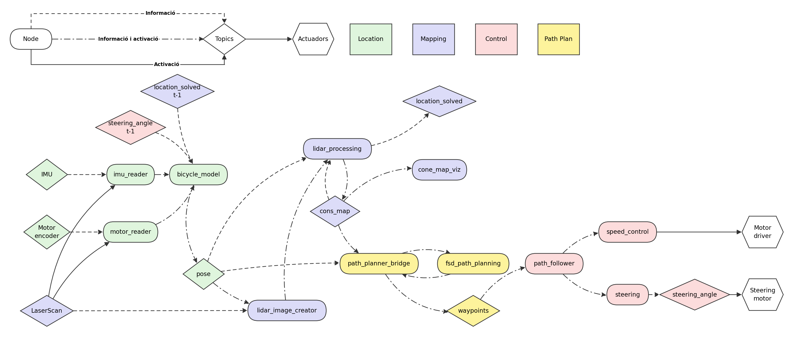

*Imatge 12: Mapa conceptual de l'organització del sistema*

---

## ÍNDEX D'IMATGES

- [Imatge 1: Projecte VaMP d'Ernst Dickmanns (Mercedes 500 SEL)](#imatge-1)
- [Imatge 2: Geometria d'Ackermann (modificada)](#imatge-2)
- [Imatge 3: Geometria d'Ackermann del nostre cotxe. Feta des de Fusion 360.](#imatge-3)
- [Imatge 4: Funcionament del diferencial (modificada)](#imatge-4)
- [Imatge 5: Transmissió Ackerman-servomotor. Feta des de Fusion 360.](#imatge-5)
- [Imatge 6: Bambu Lab P1S](#imatge-6)
- [Imatge 7: Bambu Lab H2D](#imatge-7)
- [Imatge 8: Exemple simple funcionament ros2](#imatge-8)
- [Imatge 9: Dibuix orientatiu bicycle model](#imatge-9)
- [Imatge 10: Simulació path plan en una recta](#imatge-10)
- [Imatge 11: Explicació PID](#imatge-11)
- [Imatge 12: Mapa conceptual de l'organització del sistema](#imatge-12)

## ÍNDEX DE TAULES

- [Taula 1: Comparativa dels programes de disseny 3D](#taula-1)
- [Taula 2: Dimensions del cotxe](#taula-2)
- [Taula 3: Paràmetres d'impressió](#taula-3)
- [Taula 4: Materials per a cada peça](#taula-4)
